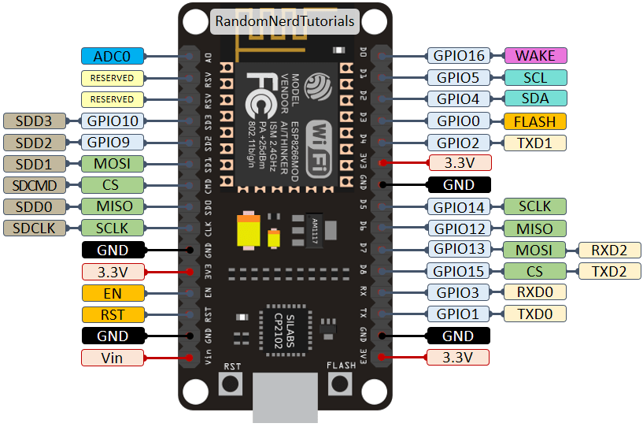

# esp8266-nrf24l01-jammer-BLE-BLUETOOTH
Modified ESP8266 Faz Jammer firmware. Removed display support, optimized code, and improved performance. Fork/mod of system-linux/FazJammer.

|NRF24L01|NodeMCU   |
|--------|----------|
|VCC     |3.3V      |
|GND     |GND       |
|CE      |D4 (GPIO2)|
|CSN     |D2 (GPIO4)|
|SCK     |D5        |
|MOSI    |D7        |
|MISO    |D6        |

|Кнопка|NodeMCU   |
|------|----------|
|Нога 1|RX (GPIO3)|
|Нога 2|GND       |

